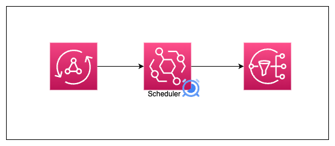
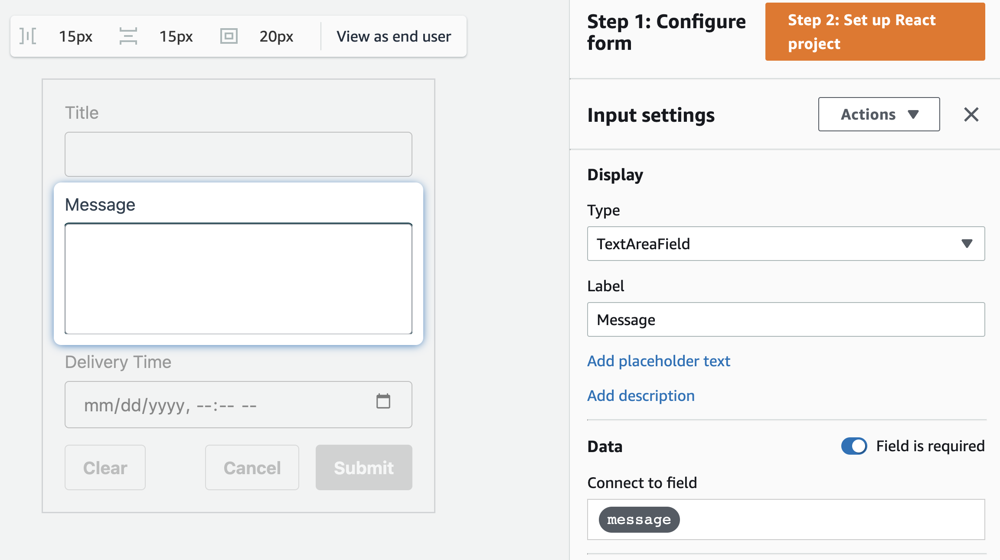
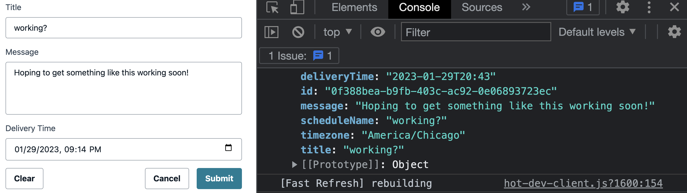

# AppSync + EventBridge Serverless Message Scheduler

This project sample allows a user to schedule future-dated messages.

Using the AWS CDK, an [AppSync API](https://aws.amazon.com/appsync/) is created that uses an HTTP datasource to dynamically create and EventBridge Scheduler. The scheduler is tied to an SNS topic that then publishes the message to topic subscribers at the specified time.



Despite an HTTP call being made, this solution is lambda-less, negating the effects of a cold start, or additional service provisioning. By using an AppSync pipeline resolver, we can pass dynamic values to our function.

Despite looking look a Lambda, the function used to make the HTTP request to create the schedule is an AppSync JavaScript function. By making use of the `context (ctx)` object and the `util` package, we can stash variables for later and access user arguments.

## Backend setup

> This part assumes you have a bootstrapped CDK environment already configured.
> After cloning this repo, install the dependencies with the following command:

`npm install`

From there, deploy the project to your AWS account:

`npx aws-cdk deploy`

Once deployed, note the values outputted in your terminal. You will need these if wanting to setup your frontend.

> This project does not have an endpoint to add subscribers. To add a subscriber, such as an email, service, or otherwise, find the _reminderTopic_ in the AWS Console under the SNS service. From there, follow the steps to add an email subscriber.

## Frontend setup

1. Create a react project. I'll use NextJS but feel free to use a different framework:

`npx create-next-app scheduler-frontend`

2. Install the Amplify component library and the JS libraries

`npm i @aws-amplify/ui-react aws-amplify`

3. Update the 2 files below with the relevant code snippets

```jsx
// _app.js file
import '@aws-amplify/ui-react/styles.css'
import { ThemeProvider } from '@aws-amplify/ui-react'
import { Amplify } from 'aws-amplify'
Amplify.configure({
	aws_appsync_graphqlEndpoint:
		'https://YOUR_API_ID.appsync-api.YOUR_API_REGION.amazonaws.com/graphql',
	aws_appsync_region: 'YOUR_API_REGION',
	aws_appsync_authenticationType: 'API_KEY', // Literally the string "API_KEY"
	aws_appsync_apiKey: 'YOUR_API_KEY', // Your actual API Key
})

export default function App({ Component, pageProps }) {
	return (
		<ThemeProvider>
			<Component {...pageProps} />
		</ThemeProvider>
	)
}
```

```jsx
//pages/index.js file
import { API } from 'aws-amplify'
import { MyForm } from '../ui-components'

const createSchedule = /* GraphQL */ `
	mutation CreateSchedule($input: ScheduleInput) {
		createSchedule(input: $input) {
			id
			title
			message
			timezone
			deliveryTime
			scheduleName
		}
	}
`

export default function Home() {
	const handleSubmit = async ({ title, message, deliveryTime }) => {
		const timezone = Intl.DateTimeFormat().resolvedOptions().timeZone

		const res = await API.graphql({
			query: createSchedule,
			variables: {
				input: {
					title,
					message,
					deliveryTime,
					timezone,
				},
			},
		})
		console.log(res.data.createSchedule)
	}
	return (
		<>
			<MyForm onSubmit={handleSubmit} />
		</>
	)
}
```

4. Create the form: Head to the [Amplify Form Builder page](https://sandbox.amplifyapp.com/ui-library/form/edit) and create a form as shown in the screenshot below:



5. Run the application to view a page similar to the screenshot below:

`npm run dev`

> The application defaults to running on localhost:3000


